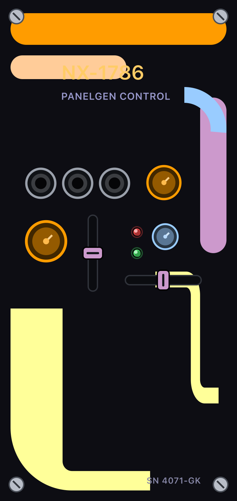

# PanelGenerator

**A native macOS editor for designing VCV Rack front panels — with a Star Trek:
TNG / LCARS soul.**

Filled curved shapes are first-class citizens: LCARS elbows, sweeping ring
sectors, and per-corner-radius boxes (pills & capsules) sit right next to the
synth primitives — jacks, rotating knobs, and faders — in a drag-and-drop
repository. Colours are edited with the **native macOS colour picker**
(`NSColorWell`), backed by a curated Okudagram swatch bank.



## Features

- **Panels in HP × U** — width in HP, height 1U or 3U, using VCV Rack's SVG
  conventions (1 HP = 15 px, 3U = 380 px, 1U = 127 px) so exports drop
  straight into Rack-sized layouts.
- **Drag-and-drop repo** — jacks, knobs (L/M/S with rotatable pointer),
  vertical/horizontal faders, LEDs, screws, text labels; plus the shape kit:
  box (per-corner radii), ellipse, triangle, LCARS elbow (thickness, inner
  radius, arm lengths, mirror/flip), ring sector (start/sweep/thickness).
- **Real editing** — click / shift-click / marquee selection, move & resize
  with HP-grid snapping, rotation, z-order, duplicate, delete, full undo/redo,
  zoom (fit / actual / in / out).
- **One vector truth** — canvas, PNG and SVG all consume the same `CGPath`
  data; exports can never drift from what you see.
- **Export** — SVG (vector, Rack-compatible px space) and PNG at 4×
  (720×1520 for a 12HP 3U panel). Text exports as **glyph outlines** by
  default: VCV Rack parses SVG with nanosvg, which has no text support and
  drops `<text>` silently, taking every label with it. Turning *Text ▸ Export
  as outlines* off emits editable `<text>` instead, for handing a panel to
  Illustrator / Inkscape.
- **Documents** — JSON `.panelgen` files; Open/Save/Save As with dirty-state
  prompts.
- **Headless smoke test** — `PanelGenerator --selftest [dir]` renders a
  showcase panel to SVG+PNG without a window server.

## Build & run

Requires macOS 13+ and Xcode command line tools.

```bash
make run        # build debug + launch the editor
make app        # build release + assemble PanelGenerator.app, then: open PanelGenerator.app
make selftest   # headless render test → Docs/pg_demo.{svg,png}
```

Or plain SPM: `swift build && .build/debug/PanelGenerator`.

## Using the editor

1. **Drag** a primitive or shape from the left repo onto the panel
   (double-click drops it centred).
2. Select and edit in the right inspector: position, size, rotation, fill
   (native colour picker + LCARS swatches), stroke, and per-kind parameters
   (knob pointer angle, fader value, corner radii, elbow geometry, ring
   angles, text content).
3. Compose the backdrop first (big elbows + ring sectors + capsules read as
   instant TNG), then place controls on top.
4. **File ▸ Export SVG… / Export PNG…**.

### Shortcuts

| Action | Keys |
|---|---|
| Undo / Redo | ⌘Z / ⇧⌘Z |
| Copy / Cut / Paste | ⌘C / ⌘X / ⌘V |
| Duplicate / Delete | ⌘D / ⌫ or ⌦ |
| Nudge selection | Arrow keys (⇧ + arrows = grid step) |
| Rotate selection | drag the blue ↻ badge (⇧ = 15° steps) |
| Mirror (elbow) | click or drag across the orange ⇄ / ⇅ badges |
| Select all | ⌘A |
| Zoom in / out / actual / fit | ⌘= / ⌘− / ⌘0 / ⌘9 |
| Toggle snap-to-grid | ⇧⌘G |
| New / Open / Save | ⌘N / ⌘O / ⌘S |
| Export SVG / PNG | ⌘E / ⇧⌘E |

## From panel to plugin

Every element carries a **component binding**: a role (decoration / param /
input / output / light / custom widget), an identifier, and a widget source —
either a stock Rack type or your own artwork.

- **Decoration** is artwork and stays in the exported panel.
- **Components** are drawn by Rack and MetaModule themselves, so they are left
  out of the panel artwork (painting them there would show through underneath
  the real widget) and exported as positions instead.
- **Rack default** components take their size from Rack's own SVG, so the
  on-canvas element is a placement guide — resizing it changes nothing in Rack.
- **Custom** components export their artwork to `components/<Name>.svg`, and
  `setSvg()` takes the widget's size from that file — so resizing here *is*
  how you resize the control.

SVGs export with their `width`/`height` in **millimetres** and the viewBox left
in panel pixels — nothing is rescaled, but the physical size is declared. That
matters downstream: `helper.py` skips its 75-dpi guess, and MetaModule
rasterisers read the physical size from that attribute (at least one raises
outright on a unitless value). Switch it to pixels in the Panel section if you
need the old form.

`File ▸ Export SVG…` writes the panel plus `<name>-components.svg`, a positions
file in the shape `helper.py createmodule` expects (circles, classified by
fill, named through `data-name` with an optional `#WidgetClass` suffix).

`File ▸ Export Widget Code…` (⌥⌘E) writes the C++ directly: `ParamId` /
`InputId` / `OutputId` / `LightId` enums, `app::SvgKnob` / `SvgPort` /
`SvgSlider` / `SvgSwitch` structs for each custom widget, the `ModuleWidget`
constructor body with `createParamCentered<…>(mm2px(Vec(x, y)), …)`, and the
matching millimetre table for MetaModule — whose elements use the same mm
coordinates, with knob angles in degrees rather than Rack's radians.

## Architecture

```
Model (value types, JSON)           Geometry: 1HP=15px · 3U=380px · 1U=127px
  PanelDocument → [PanelElement]
        │
        ▼
Renderer — parts(for:) -> [ShapePart(CGPath, fill, stroke)]   ← single source of truth
        ├── CanvasView        interactive AppKit surface + overlays
        ├── PNGExporter       CGContext over NSBitmapImageRep, 4×
        └── SVGExporter       CGPath → <path d="…"> walker (PathSVG)
```

Source layout: `Sources/PanelGenerator/` — `Model.swift`, `Geometry.swift`,
`Renderer.swift`, `PathSVG.swift`, `Exporters.swift`, `CanvasView.swift`,
`PaletteView.swift`, `InspectorView.swift`, `MainWindowController.swift`,
`AppDelegate.swift`, `Selftest.swift`, `main.swift`.

## Status & roadmap

This is a **prototype** (see `PLAN.md` for the phase log and deliberate
simplifications). Done since the first cut: multi-select align/distribute
(selection bounds + panel-relative), layer list with hide/reorder, and
group/ungroup. Next up, in rough order: freeform bezier shape authoring
with draggable control points, panel templates, and NSDocument migration
(autosave + versions).

## License

MIT — see [LICENSE](LICENSE).
